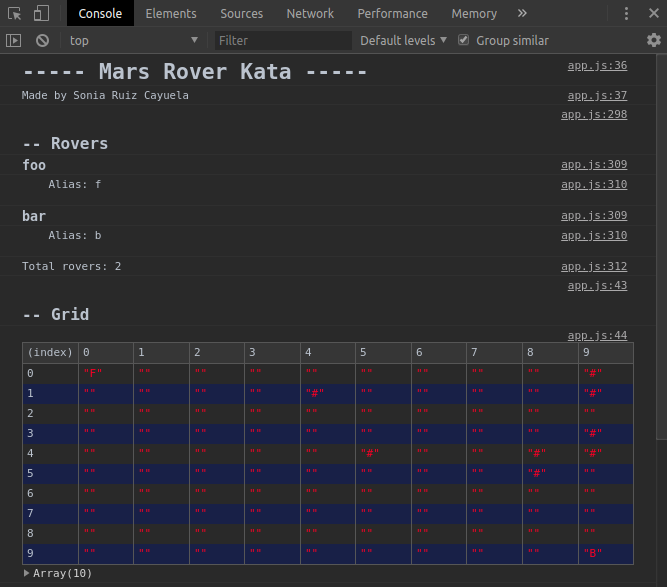
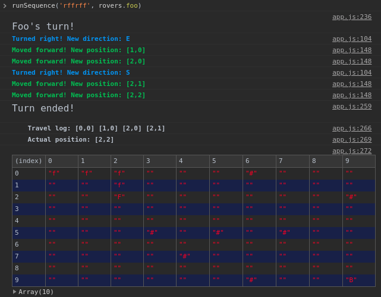

# Mars Rover Kata

Exercise made for the Ironhack Prework.

A simply rover simulator that responds a commands to move forward, backward and turn left or right in a grid. The script creates a grid and random obstacles and only works in console (no UI).



The above table represents the grid which show the rovers and obstacles.

**Legend**:

 - **#**: obstacle.
 - **Capital Letters:** actual position of rovers.
 - **Lowercase Letters:** previous positions.

You can access in [this link](https://yunevk.github.io/mars-rover-kata/). Don't forget to open the *DevTools*.

## Instructions

Call the function `runSequence(sequence, rover)`, in console, passing the following parameters: 

- `sequence` - A string with all the commands that the rover will follow. These only can be:
  - `f` to move forward.
  - `b` to move backward.
  - `r` to turn right.
  - `l` to turn left.
- `rover` - The rover that will move.

## Usage example

For example, you can run the following line:

`runSequence('rffrff', rovers.foo)`

And see the output:



## Configuration

You can change the *Mars Rover Kata* configuration changing the following lines of the `app.js` file:

```javascript
// To change the rovers configuration, add and delete.
var rovers = {
  foo: {
    name: 'Foo',
    alias: 'f',
    direction: 'N', 
    x: 0, 
    y: 0, 
    travelLog: []
  }, 
  bar: {
    name: 'Bar',
    alias: 'b',
    direction: 'N', 
    x: 9, 
    y: 9, 
    travelLog: []
  }
};

// To change the grid size and the total number of obstacles
var gridSize = {
  x: 10,
  y: 10
};
var totalObstacles = 7;
```

## Author

- **Sonia Ruiz Cayuela** - [@Yune__vk](https://twitter.com/Yune__vk) - yune.vk@gmail.com - [Website](https://yunevk.github.io)


>I hope you like it! \ (•◡•) /